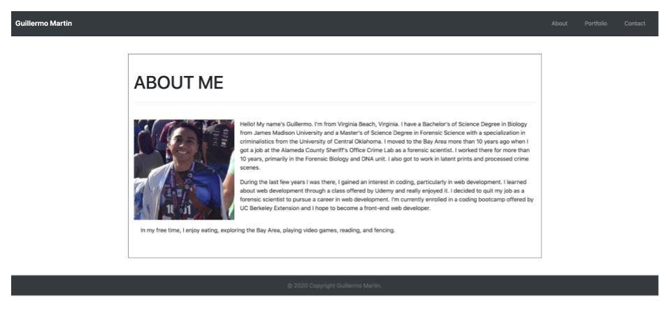
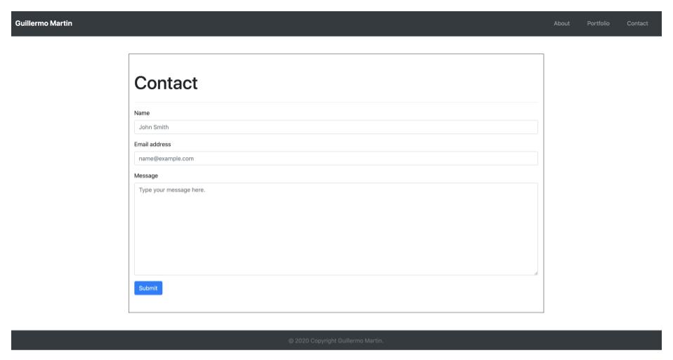

# Responsiveness Portfolio
https://guillermo-martin.github.io/homework2/  

## Description
This application displays a biography about me, has a contact page, and a portfolio page to display all my projects.  A user can read about me and click on the various links to look at a portfolio or form to contact me.

## Technologies
This application uses the following:  HTML5, CSS, Bootstrap, W3C Validation Service, and is deployed using GitHub Pages.

## Challenges
* Your experience building this app  
    * I had a fun experience overall creating this app, though there were also times when it was challenging.
* What was difficult
    * One of the difficult parts I had was trying to wrap text around my image on the index.html file.  Another difficult part was putting a text box over an image in the portfolio.html file and trying to size it correctly with the image.
* What did you learn
    * I learned how to use Bootstrap, its components, and its classes, and how to navigate the documentation.
* How did you go about solving the problem
    * I solved my problem by Googling the particular problem I was having, reading up on solutions I found online, and trying them out in my code.  I also went to office hours and asked.

## Screenshots  
About Me  
  

Contact  
  

Portfolio  

